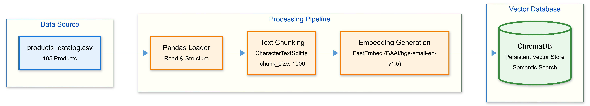
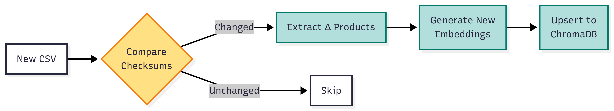

# Data Pipeline Diagram

## Overview

This diagram illustrates the data ingestion pipeline that transforms the product catalog CSV into a searchable vector database.



## Pipeline Stages

### 1. Data Source

**products_catalog.csv** - Contains 105 products with attributes:

- Product ID, Name, Category
- Price, Cost, Stock Level
- Description, Features
- Ratings, Reviews

### 2. Processing Pipeline

#### Pandas Loader

- Reads CSV into structured DataFrame
- Validates data integrity
- Handles missing values

#### Text Chunking

- Splits product descriptions into chunks (1000 characters)
- Optimizes for retrieval performance
- Preserves context with overlap

#### Embedding Generation

- Uses **FastEmbed** (BAAI/bge-small-en-v1.5)
- Local ONNX runtime - **No API costs**
- Generates 384-dimensional vectors
- ~10ms per product

### 3. Vector Storage

**ChromaDB** stores:

- Vector embeddings for semantic search
- Original metadata (price, category, etc.)
- Persistent disk storage (`data/chroma_db/`)

## Monthly Update Strategy

### Current Implementation (Full Re-index)

```
1. Delete existing ChromaDB collection
2. Re-read entire CSV
3. Re-generate all embeddings
4. Re-insert into vector store
```

**Runtime**: ~5-10 seconds for 105 products

### Recommended for Production (Incremental Updates)



**Benefits**:

- Only process changed products
- Preserve existing embeddings
- 10-100x faster for small updates

**Implementation**:

```python
# Compute MD5 hash of each product record
# Compare with stored hashes
# Only embed new/modified products
# Use upsert() instead of add()
```

## Performance Characteristics

| Metric                  | Value           |
| ----------------------- | --------------- |
| **Ingestion Time**      | 5-10 seconds    |
| **Products**            | 105             |
| **Embedding Dimension** | 384             |
| **Chunk Size**          | 1000 characters |
| **Storage Size**        | ~15 MB          |
| **Query Latency**       | 100-300 ms      |

## Scaling Considerations

- **Current Capacity**: Suitable for up to 10,000 products
- **For 10k-100k products**: Consider batch processing
- **For 100k+ products**: Migrate to managed service (Qdrant, Pinecone)
