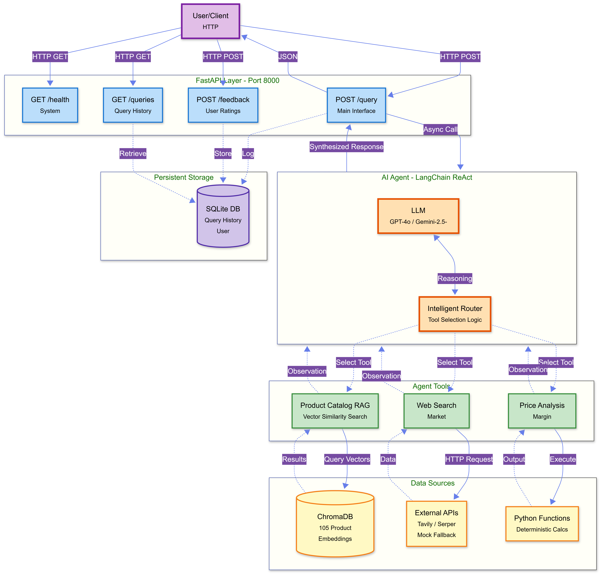
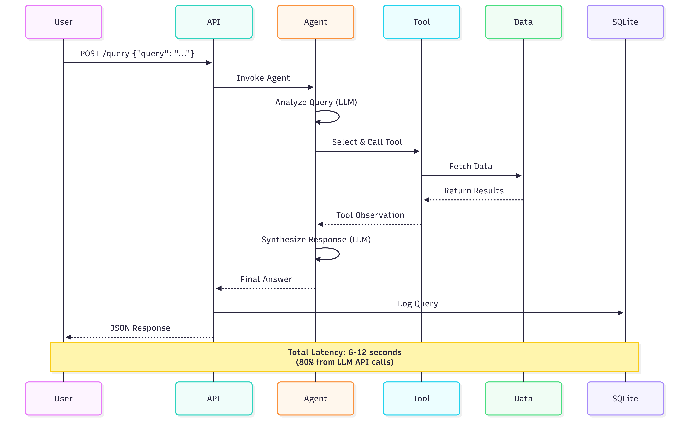

# System Architecture Diagram

## Overview

Complete system architecture showing the flow from user queries through the AI agent to various data sources and back.



## Architecture Components

### 1. API Layer (FastAPI)

Modern async web framework handling all HTTP traffic:

| Endpoint    | Method | Purpose                | Response Time |
| ----------- | ------ | ---------------------- | ------------- |
| `/health`   | GET    | System status check    | ~10ms         |
| `/query`    | POST   | Main agent interface   | 6-12s         |
| `/queries`  | GET    | Retrieve query history | ~50ms         |
| `/feedback` | POST   | Submit user ratings    | ~20ms         |

**Features**:

- Async request handling
- Automatic OpenAPI docs (`/docs`)
- SQLAlchemy ORM integration
- CORS enabled for web clients

### 2. AI Agent (LangChain ReAct)

**LLM Options**:

- **OpenAI**: GPT-4o, GPT-3.5-turbo
- **Google**: Gemini-2.5-Pro, Gemini-2.5-Flash

**Agent Pattern**: ReAct (Reasoning + Action)

```
1. Thought: Analyze user query
2. Action: Select appropriate tool
3. Observation: Get tool results
4. Repeat until answered
5. Final Answer: Synthesized response
```

**Intelligent Router**:

- Classifies query intent
- Selects optimal tool(s)
- Handles multi-step reasoning
- Synthesizes final answer

### 3. Agent Tools

#### Product Catalog RAG

- **Technology**: ChromaDB vector search
- **Embedding**: BAAI/bge-small-en-v1.5 (384-dim)
- **Data**: 105 products from internal catalog
- **Latency**: 100-300ms per query
- **Use Case**: "What wireless headphones do we have?"

#### Web Search

- **Primary**: Tavily API (recommended)
- **Secondary**: Serper API (Google Search)
- **Fallback**: Mock data (documented)
- **Latency**: 500-2000ms
- **Use Case**: "Current market price for noise-cancelling headphones?"

#### Price Analysis

- **Type**: Deterministic calculations
- **Functions**: Margin, markup, profit calculations
- **Latency**: <1ms
- **Use Case**: "Calculate margin for price $100, cost $60"

### 4. Data Sources

| Source           | Type          | Size  | Purpose            |
| ---------------- | ------------- | ----- | ------------------ |
| ChromaDB         | Vector DB     | 15 MB | Product embeddings |
| Tavily/Serper    | REST API      | N/A   | Market data        |
| Python Functions | In-memory     | <1 KB | Calculations       |
| SQLite           | Relational DB | <1 MB | History/Feedback   |

### 5. Persistent Storage

**SQLite Database** stores:

- Query history (UUID, query, response, timestamp)
- User feedback (rating, comments)
- Analytics metadata

## Data Flow Sequence



## Performance Characteristics

### Response Time Breakdown (p50)

```
Total: 6,000ms
├── API Routing: 50ms (1%)
├── Agent Analysis: 2,000ms (33%)
├── Tool Execution: 500ms (8%)
├── LLM Synthesis: 3,000ms (50%)
└── Database Logging: 50ms (1%)
└── Network: 400ms (7%)
```

**Bottleneck**: External LLM API latency (80-90% of total time)

### Throughput

- **Current**: 0.54 RPS (5 concurrent users)
- **Theoretical Max**: ~2 RPS (limited by LLM API)
- **With Caching**: ~5-10 RPS (60% cache hit rate)

## Scalability Roadmap

### Phase 1: Foundation (Current)

✅ Single instance deployment  
✅ Local ChromaDB  
✅ SQLite database  
✅ Direct LLM API calls

**Capacity**: 5-10 concurrent users

### Phase 2: Optimization (1-3 months)

- [ ] Redis caching layer
- [ ] Response streaming (SSE)
- [ ] Connection pooling
- [ ] Query batching

**Expected Capacity**: 50 concurrent users

### Phase 3: Horizontal Scale (3-6 months)

- [ ] Multi-instance deployment
- [ ] Load balancer (nginx/traefik)
- [ ] Managed vector DB (Qdrant Cloud)
- [ ] PostgreSQL (replace SQLite)

**Expected Capacity**: 500+ concurrent users

### Phase 4: Enterprise Scale (6+ months)

- [ ] Kubernetes orchestration
- [ ] Multi-region deployment
- [ ] Self-hosted LLM (Llama 3.1)
- [ ] CDN for static assets

**Expected Capacity**: 10,000+ concurrent users

## Technology Choices

### Why FastAPI?

- ✅ Async/await for concurrency
- ✅ Automatic API documentation
- ✅ Type hints & validation
- ✅ Modern Python patterns

### Why LangChain?

- ✅ Agent abstraction
- ✅ Multi-LLM support
- ✅ Tool calling framework
- ✅ Large ecosystem

### Why ChromaDB?

- ✅ Easy local development
- ✅ Good for <100k vectors
- ✅ Simple API
- ✅ Persistent storage

### Why SQLite?

- ✅ Zero configuration
- ✅ Embedded database
- ✅ Perfect for MVP
- ⚠️ Replace with PostgreSQL for production

## Security Considerations

- ⚠️ **No Authentication**: Public API endpoints
- ⚠️ **No Rate Limiting**: Vulnerable to abuse
- ⚠️ **API Keys in .env**: Must secure in production
- ✅ **No PII Storage**: Queries logged but not user identifiable
- ⚠️ **Prompt Injection**: LLM vulnerable to adversarial inputs

**Production Checklist**:

- [ ] Add JWT authentication
- [ ] Implement rate limiting (10 req/min per user)
- [ ] Use secrets manager for API keys
- [ ] Add input sanitization
- [ ] Enable HTTPS only
- [ ] Add request logging & monitoring
